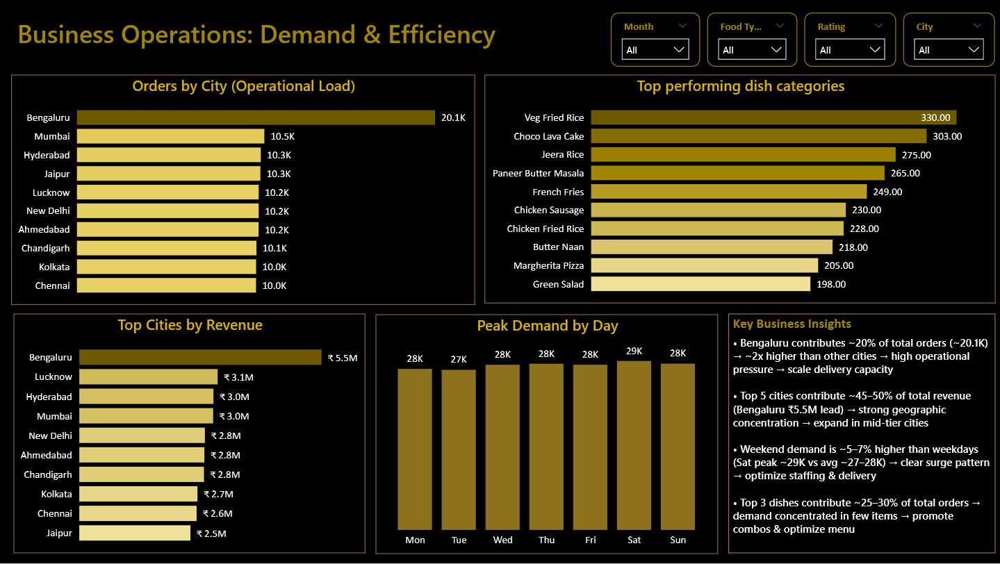

# OrderIQ — Food Delivery Analytics Platform

> End-to-end analytics system built on Microsoft Fabric: raw CSV → Lakehouse → Data Warehouse → Power BI.  
> Analyzed 197K+ orders to surface revenue concentration, demand-supply gaps, and growth opportunities.

---

## Business impact

| Finding | Insight | Action |
|---|---|---|
| Revenue concentration | Top states drive majority of revenue (Pareto effect) | Focus marketing + expansion in high-performing regions |
| Premium order value | Orders >₹500 contribute ~40–50% of total revenue | Promote premium combos + upselling to lift revenue without volume increase |
| Demand-supply gap | High-revenue regions show low restaurant density | Onboard restaurants in underserved high-demand areas |
| Seasonal trends | MoM fluctuations in order volume | Run targeted campaigns in low-demand months to stabilize revenue |
| Rating bias | Ratings cluster 4.0–4.5 with low variance | Improve feedback granularity for actionable quality signals |

Pipeline reduced manual analysis effort by ~70%.

---

## Architecture

```
Raw CSV → Lakehouse (Bronze) → Data Pipeline → Data Warehouse (Silver/Gold) → Power BI
```

Star schema data model:
- `fact_orders` — core transactional data
- `dim_date` · `dim_location` · `dim_restaurant` · `dim_dish`

Enables efficient joins, scalable analytics, and real-world BI use cases.

---

## SQL analytics

Business queries built using CTEs, window functions, ranking, and time-series analysis:

- Revenue ranking by state and city
- Demand vs supply (revenue per restaurant)
- Order value segmentation — budget / mid / premium
- Price vs rating correlation
- Month-over-month growth trends
- Top restaurant revenue contribution

→ [`SQL_Query.sql`](./SQL_Query.sql)

---

# Dashboard

<div align="center">

<table>
<tr>
<td align="center">
<h3>Executive View</h3>

</td>

<td align="center">
<h3>Business View</h3>

</td>
</tr>
</table>

</div>

<br>

Power BI template: <a href="./Dashboard.pbit">Dashboard.pbit</a>

---

## Stack

| Layer | Tools |
|---|---|
| Data platform | Microsoft Fabric — Lakehouse, Data Warehouse, Pipelines |
| Query layer | T-SQL — CTEs, window functions, aggregations |
| Visualization | Power BI — KPIs, slicers, drill-through |
| Exploration | Python — EDA and data simulation |

---

## Project structure

```
OrderIQ-Food-Delivery-Analytics/
├── charts/            # Chart exports
├── data/raw/          # Raw datasets (synthetic, real-world patterns)
├── warehouse/         # Data warehouse models
├── EDA.ipynb          # Exploratory data analysis
├── Dashboard.pbit     # Power BI template
├── SQL Query.sql      # Full SQL analysis
├── pdf.pdf            # Project report
└── README.md
```

---

## Roadmap

- [ ] Demand forecasting (Prophet / ML)
- [ ] Customer segmentation (RFM / clustering)
- [ ] Real-time streaming pipeline
- [ ] Power BI Service deployment

---

## About

[Seema Kumari](https://github.com/seema-kri) — Data Analyst building systems that drive decisions, not just dashboards.  
[LinkedIn](https://www.linkedin.com/in/seema-kumari-375763308/) · [HackerRank](https://www.hackerrank.com/profile/seemakri136) · [LeetCode](https://leetcode.com/u/seemakri136/)
