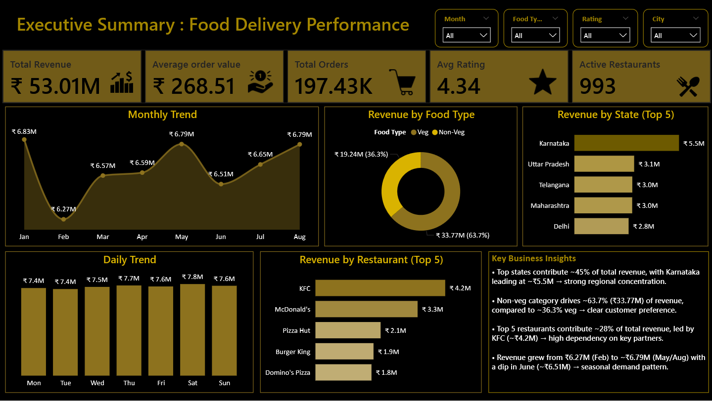

# 🍔 OrderIQ — Food Delivery Analytics Platform

> End-to-end data engineering pipeline built on **Microsoft Fabric** · **197,430 simulated orders** · Star schema data warehouse · 10 analytical SQL modules · Interactive Power BI dashboard

[](https://learn.microsoft.com/en-us/fabric/)
[](https://powerbi.microsoft.com/)
[](https://learn.microsoft.com/en-us/sql/t-sql/)
[](https://www.python.org/)

---

## 📋 Table of Contents

- [Problem Statement](#-problem-statement)
- [Architecture](#-architecture)
- [Data Model](#-data-model--star-schema)
- [SQL Analytics](#-sql-analytics--10-business-questions)
- [Dashboard Preview](#-dashboard-preview)
- [Key Findings](#-key-findings)
- [Project Structure](#-project-structure)
- [Tech Stack](#-tech-stack)
- [How to Run](#-how-to-run)
- [Limitations & Next Steps](#-limitations--next-steps)
- [Author](#-author)

---

## ❓ Problem Statement

Food delivery platforms generate massive operational data daily — but raw transactional logs don't answer the questions that drive business decisions:

- Which states and cities generate disproportionate revenue?
- Do premium orders (₹500+) correlate with higher customer satisfaction?
- Where is restaurant supply failing to meet demand?
- What does month-over-month revenue trend reveal about seasonality?

**Goal:** Build complete infrastructure to answer these — raw data ingestion → SQL transformation → star schema modeling → Power BI dashboard — using Microsoft Fabric as unified analytics platform.

> **Data Note:** All data is synthetically generated to simulate realistic food delivery operations. Reflects plausible business patterns — order volumes, price distributions, geographic spread, rating behavior — with no real customer or business information.

---

## 🏗 Architecture

```
Raw CSVs
   │
   ▼
Lakehouse (swiggylw)          ← raw storage layer, OneLake
   │
   ▼  [Fabric Data Pipeline — 5 parallel Copy activities, ~43s total]
   │
   ▼
Data Warehouse (swiggy_dw)    ← SQL cleaning, star schema modeling
   │
   ▼
Power BI Semantic Model       ← relationships, KPI measures defined
   │
   ▼
Power BI Report               ← interactive dashboards for stakeholders
```

| Layer | Tool | Purpose |
|---|---|---|
| Raw Storage | Fabric Lakehouse | Holds source files before processing |
| Ingestion | Fabric Data Pipelines | Parallel copy from Lakehouse → DW |
| Modeling | Fabric Data Warehouse | Star schema + SQL analytics |
| Semantic Layer | Power BI Semantic Model | Relationships, measures, KPIs |
| Visualization | Power BI Report | Business-facing interactive dashboards |

---

## 🗂 Data Model — Star Schema

```
     dim_date              dim_location
   ┌──────────┐           ┌──────────────┐
   │ date_id  │           │ location_id  │
   │order_date│           │ city         │
   │order_date│           │ state        │
   │  _new    │           │ location     │
   └────┬─────┘           └──────┬───────┘
        │  1                     │  1
        │                        │
        ▼  *                     ▼  *
   ┌─────────────────────────────────────┐
   │              fact_orders            │
   │  order_id · price · rating          │
   │  rating_count · date_id             │
   │  location_id · restaurant_id        │
   │  food_id                            │
   └──────────────┬──────────────────────┘
                  │  *         *  │
        ┌─────────┘               └──────────┐
        ▼  1                              1  ▼
   ┌──────────┐                    ┌──────────────┐
   │ dim_dish │                    │dim_restaurant│
   │ dish_id  │                    │restaurant_id │
   │ dish_name│                    │restaurant    │
   │ category │                    │  _name       │
   └──────────┘                    └──────────────┘
```

**Data quality fix applied:** Source `order_date` field used European format (DD-MM-YYYY). Added `order_date_new` column via `TRY_CONVERT(date, order_date, 5)` and validated for NULLs before downstream use.

---

## 📊 Dashboard Preview

| Executive Dashboard | Business Dashboard |
|---|---|
|  |  |

---

## 🔍 SQL Analytics — 10 Business Questions

Every query answers a real stakeholder decision — not just SQL syntax demonstration.

### Revenue & Geography

**1. State-level revenue ranking**
```sql
SELECT dl.state,
       COUNT(fo.order_id)                                  AS total_orders,
       ROUND(SUM(fo.price), 0)                             AS total_revenue,
       ROUND(AVG(fo.price), 0)                             AS avg_order_value,
       COUNT(DISTINCT fo.restaurant_id)                    AS num_restaurants,
       RANK() OVER (ORDER BY SUM(fo.price) DESC)           AS revenue_rank
FROM swiggy_project.fact_orders fo
JOIN swiggy_project.dim_location dl ON fo.location_id = dl.location_id
GROUP BY dl.state
ORDER BY total_revenue DESC
```
*Decision:* Where to concentrate marketing spend and restaurant acquisition.

**2. City-level breakdown (Top 15)** — Cross-dimension analysis at state + city granularity with `RANK()` window function.

**3. Restaurant density vs. demand** — Computes `revenue_per_restaurant` and `orders_per_restaurant` per state; surfaces expansion opportunities vs. oversaturated markets.

### Customer & Order Behavior

**4. Order value segmentation**
```sql
SELECT CASE
         WHEN price < 200               THEN 'Budget (<₹200)'
         WHEN price BETWEEN 200 AND 500 THEN 'Mid (₹200-500)'
         WHEN price > 500               THEN 'Premium (>₹500)'
       END                                                              AS order_segment,
       COUNT(order_id)                                                  AS total_orders,
       ROUND(COUNT(order_id) * 100.0 / SUM(COUNT(order_id)) OVER(), 1) AS order_share_pct,
       ROUND(SUM(price)      * 100.0 / SUM(SUM(price))      OVER(), 1) AS revenue_share_pct
FROM swiggy_project.fact_orders
WHERE price BETWEEN 10 AND 3000
GROUP BY CASE ... END
```
*Decision:* Are budget orders subsidized by premium revenue? Should pricing strategy shift?

**5. Price vs. rating correlation** — 4-tier segmentation with avg rating, review count, and % orders reviewed per tier.

**6. Rating distribution** — Frequency analysis detecting clustering, scale compression, or submission bias.

### Growth & Trends

**7. Month-over-month revenue growth**
```sql
ROUND(
  (SUM(fo.price) - LAG(SUM(fo.price)) OVER (ORDER BY MONTH(dd.order_date_new)))
  / LAG(SUM(fo.price)) OVER (ORDER BY MONTH(dd.order_date_new)) * 100, 1
) AS mom_growth_pct
```
*Decision:* Which months show negative growth? Seasonal or structural?

**8. Top restaurants by revenue share** — Uses `SUM(...) OVER ()` to compute each restaurant's % contribution to total platform revenue.

**9. Average order value by food category** — Filtered to categories ≥100 orders (statistical significance), ranked by AOV.

**10. [Additional query]** — See `SQL_Query.sql` for full set.

---

## 📈 Key Findings

| Finding | Insight |
|---|---|
| 197,430 orders across all states | Sufficient volume for statistically stable segment analysis |
| Revenue follows power-law distribution | Top states generate majority of platform revenue |
| High-value orders (>₹500) = minority of volume | Contribute disproportionately to revenue — classic 80/20 |
| Rating distribution left-skewed | Clustering at 4.0–4.5: genuine quality or selection bias |
| Restaurant density asymmetry | Some states show high revenue-per-restaurant (demand > supply) |
| MoM trend shows seasonality | Post-festival slowdowns, regional summer dips |

---

## 🗃 Project Structure

```
OrderIQ-Food-Delivery-Analytics/
├── data/
│   └── raw/                    # Simulated source CSV files
├── warehouse/                  # DW schema screenshots, data model diagrams
├── charts/                     # EDA output visualizations
├── EDA.ipynb                   # Exploratory data analysis (Python)
├── SQL_Query.sql               # All 10 analytical queries
├── Dashboard.pbit              # Power BI template (connect your own DW)
├── business.png                # Business dashboard screenshot
├── excecutive.png              # Executive dashboard screenshot
├── pdf.pdf                     # Project report
└── README.md
```

---

## 🛠 Tech Stack

| Tool | Usage |
|---|---|
| **Microsoft Fabric** (Lakehouse + DW + Pipelines + Semantic Model) | Unified analytics platform |
| **T-SQL** | Data cleaning, star schema modeling, window function analytics |
| **Power BI** | Semantic model + interactive report |
| **Python / Jupyter** | EDA, data simulation, statistical profiling |
| **Git / GitHub** | Version control, documentation |

---

## ▶ How to Run

```bash
# Clone the repository
git clone https://github.com/seema-kri/OrderIQ-Food-Delivery-Analytics.git
cd OrderIQ-Food-Delivery-Analytics
```

**Step 1 — Fabric Setup**
1. Create a Microsoft Fabric workspace
2. Create a Lakehouse named `swiggylw`
3. Upload CSVs from `data/raw/` to the Lakehouse Files section

**Step 2 — Run Pipeline**
1. Create a Data Pipeline in Fabric
2. Add 5 parallel Copy Data activities (Lakehouse → Data Warehouse)
3. Run pipeline (~43s total)

**Step 3 — SQL Analytics**
1. Open the Data Warehouse query editor
2. Run queries from `SQL_Query.sql`

**Step 4 — Power BI**
1. Open `Dashboard.pbit` in Power BI Desktop
2. Connect to your Fabric Data Warehouse
3. Refresh to load data

---

## ⚠ Limitations & Next Steps

| Current Limitation | Production Approach |
|---|---|
| No customer IDs → no cohort analysis | Add `dim_customer`, build RFM segments |
| No delivery time data | Join delivery partner logs, correlate ETA variance with ratings |
| Full reload pipeline | Implement watermark-based incremental loads on `fact_orders` |
| No access governance | Add Power BI row-level security scoped by state/region |
| No forecasting layer | Feed MoM trend into Prophet for demand forecasting |
| No data quality monitoring | Add NULL checks, referential integrity tests, freshness assertions |

---

## 👩‍💻 Author

**Seema** · Data Analyst

[](https://github.com/seema-kri)

---

*⭐ Star this repo if you found it useful!*
